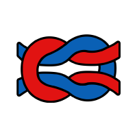
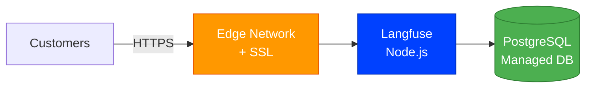
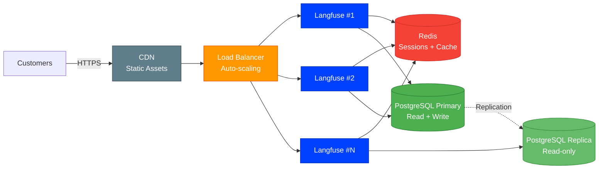

# Langfuse [](https://github.com/stackblaze-templates/langfuse) [](https://stackblaze.com) [](https://github.com/stackblaze-templates/langfuse/actions) [](LICENSE) [](https://stackblaze.com)

<p align="center"></p>

LLM engineering platform for observability, metrics, evaluations, and prompt management.

> **Credits**: Built on [Langfuse](https://langfuse.com) by [Langfuse](https://github.com/langfuse). All trademarks belong to their respective owners.

## Local Development

Copy `.env.example` to `.env` and fill in your values, then run:

```bash
docker compose up
```

> ⚠️ **Warning**: The default fallback credentials in `docker-compose.yml` are for local development only. **Always set strong, unique values for `NEXTAUTH_SECRET`, `SALT`, and `POSTGRES_PASSWORD` before any production or internet-facing deployment.**

See the project files for configuration details.

## Security Configuration

The following environment variables **must** be set to strong, unique values before production deployment:

| Variable | Description | How to generate |
|---|---|---|
| `NEXTAUTH_SECRET` | Signs NextAuth.js session tokens | `openssl rand -base64 32` |
| `SALT` | Salts password hashes | `openssl rand -base64 32` |
| `NEXTAUTH_URL` | Public base URL of your Langfuse instance | Set to your actual domain |
| `DATABASE_URL` | PostgreSQL connection string | Use a strong, unique password |
| `ENCRYPTION_KEY` | (Optional) Encrypts sensitive data at rest | `openssl rand -hex 32` |

> **Never commit real secrets.** Copy `.env.example` to `.env` and add `.env` to `.gitignore` (already included in this repo).

## Deploy on StackBlaze

[](https://stackblaze.com)

This template includes a `stackblaze.yaml` for one-click deployment on [StackBlaze](https://stackblaze.com). Both options run on **Kubernetes** for reliability and scalability.

<details>
<summary><strong>Standard Deployment</strong> — Single-instance Kubernetes setup for startups and moderate traffic</summary>

<br/>



**What you get:**
- Single Langfuse instance on Kubernetes
- Managed PostgreSQL database
- Automatic SSL/TLS via StackBlaze edge network
- Automated daily backups
- Zero-downtime deploys

**Best for:** Development, staging, and moderate-traffic production environments.

</details>

<details>
<summary><strong>High Availability Deployment</strong> — Multi-instance Kubernetes setup for business-critical production</summary>

<br/>



**What you get:**
- Auto-scaling Langfuse pods on Kubernetes behind a load balancer
- Redis for shared sessions, cache, and queue management
- PostgreSQL primary + read replica for high throughput
- CDN for static assets
- Automated failover and self-healing
- Zero-downtime rolling deploys

**Best for:** Production workloads, high-traffic applications, business-critical deployments.

</details>

---

### Maintained by [StackBlaze](https://stackblaze.com)

This template is actively maintained by StackBlaze. We perform **weekly automated checks** to ensure:

- **Up-to-date dependencies** — frameworks, libraries, and base images are kept current
- **Security scanning** — continuous monitoring for known vulnerabilities and CVEs
- **Best practices** — configurations follow current recommendations from upstream projects

Found an issue? [Open a ticket](https://github.com/stackblaze-templates/langfuse/issues).
